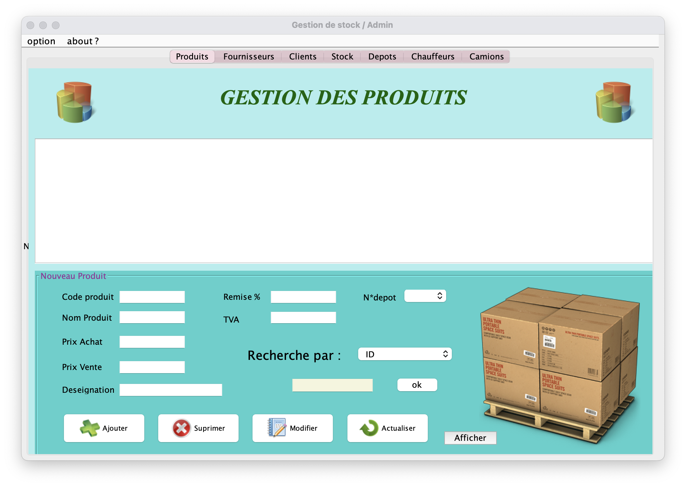
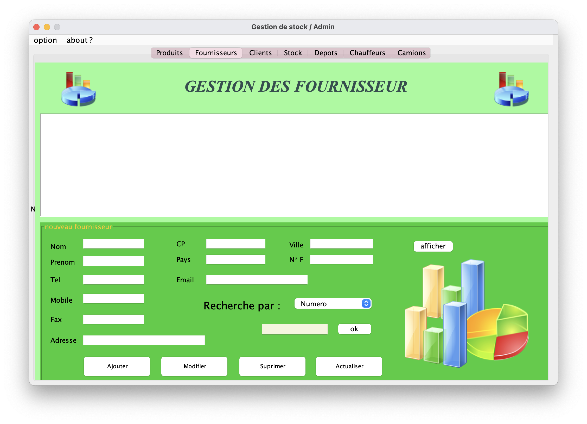
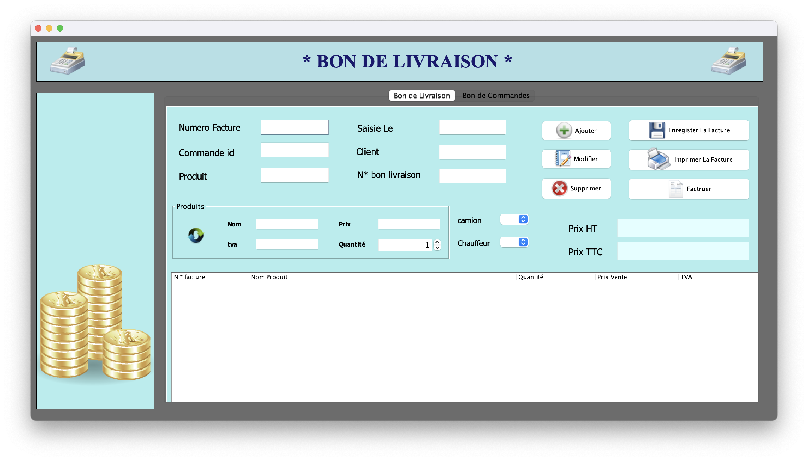

# Data Scientist & ML Specialist

---

## Certifications

  <!-- Premier badge -->
  

  
  
  <!-- Deuxième badge -->
  

  

  <!-- toisième badge -->
  

  

---

## 🔧 Skills

**Java**, **Python**, **HTML5**, **CSS3**, **SQL**, **REST APIs**, **Pandas**, **NLP**, **TensorFlow**, **Scikit-learn**, **Machine Learning**, **Maximo**, **ArcGIS**, **Esri ArcGIS**, **Git**, **Agile**, **Data Analysis**, **Team Collaboration**, **Adaptability**

---

## 🎓 Education

- **M.S, Applied Mathematics and Computer Science**  
  Université du Québec à Trois-Rivières, Canada (October 2024)

- **M.S, Computer Systems**  
  Université du 20 Août 1955 Skikda, Algeria (May 2018)

- **B.S, Mathematics and Informatics**  
  Université du 20 Août 1955 Skikda, Algeria (May 2016)
  
---

## 💼 Work Experience

### City of Montreal
**- GIS Analyst**  
*September 2023 – December 2024*
- Developed and implemented GIS systems (ArcGIS) for managing urban green spaces and trees.
- Integrated and analyzed geospatial data to optimize horticultural and arboricultural management.
- Created IT solutions to enhance data collection and analysis in the field.
- Collaborated with technical and field teams for effective GIS project implementation.

**- Office Assistant**
*May 2023 – September 2023*
- Assisted in the field data collection for 20,000 trees.
- Updated and managed databases.
- Created work orders for field personnel.

### Khanchoul Youcef Middle School, Algeria
**- Computer Science Teacher**  
*September 2019 – December 2021*
- Prepared and taught computer science courses to middle school students.
- Developed lesson plans and educational materials for different levels.
- Guided and supported students in their projects and practical work.
- Assessed student performance and provided constructive feedback.
- Participated in parent-teacher meetings and extracurricular activities related to computer science.

---

## 📂 Projects

### Lifecycle Management System (Developed with ArcGIS)
- In collaboration with the City of Montreal, I developed the "Lifecycle Management" platform using ArcGIS. This comprehensive digital solution streamlines tree management, covering everything from inspection to task execution. It provides real-time traceability and enhances internal communication.

  <!-- Replace with your project image -->

### Comparative Analysis and Spam Detection System
- I conducted an in-depth evaluation of various NLP techniques, including word2vec, Glove, FastText, and BERT, to identify the most effective approach for spam classification. I then developed a robust spam detection system, optimizing the chosen models and creating an interactive interface that allows users to input messages and receive real-time predictions on whether the messages are spam.

  <!-- Replace with your project image -->

### Handwritten Digit Recognition with Convolutional Neural Networks
- This Python program effectively utilizes convolutional neural networks to recognize and classify handwritten digits. Developed to enhance image processing and machine learning skills, the project demonstrates advanced techniques in digit recognition and classification.
  
  <!-- Replace with your project image -->

### Binary Classification System for Breast Cancer Detection
- I designed a binary classification system to differentiate between benign and malignant breast cancer, applying Principal Component Analysis (PCA) for data dimensionality reduction. This approach utilized advanced analysis techniques to improve classification accuracy, playing a crucial role in early cancer detection.
  
  <!-- Replace with your project image -->
  <!-- Replace with your project image -->

### Face Mask Detection Application (OpenCV)
- Developed an application using the OpenCV library to detect the presence of face masks, leveraging technology to promote public health awareness and ensure compliance with health standards.
  
  <!-- Replace with your project image -->

### Stock Management Application
- Développé une application de gestion de stock avec Java et MySQL.
- Conçu la base de données à l'aide d'UML et géré les connexions via MySQL Workbench.
- Mis en place plusieurs interfaces utilisateur :
Interface d'authentification
Interface pour l'administrateur permettant de gérer les produits, les fournisseurs et les camions :   
  <!-- Replace with your project image -->
  <!-- Replace with your project image -->
Interface dédiée aux vendeurs pour la gestion des ventes et des stocks.
  <!-- Replace with your project image -->

### Multi-Store E-commerce Website
- Developed an e-commerce website from scratch.
- Managed databases, developed a user-friendly interface, and ensured an optimal customer experience.
  
  <!-- Replace with your project image -->

---

## 🌐 Languages
- French
- English
- Arabic

---

Feel free to check out my [LinkedIn](https://www.linkedin.com/in/bilel-mezhoud/) and [GitHub](https://github.com/BilelMezhoud) profiles for more information!

